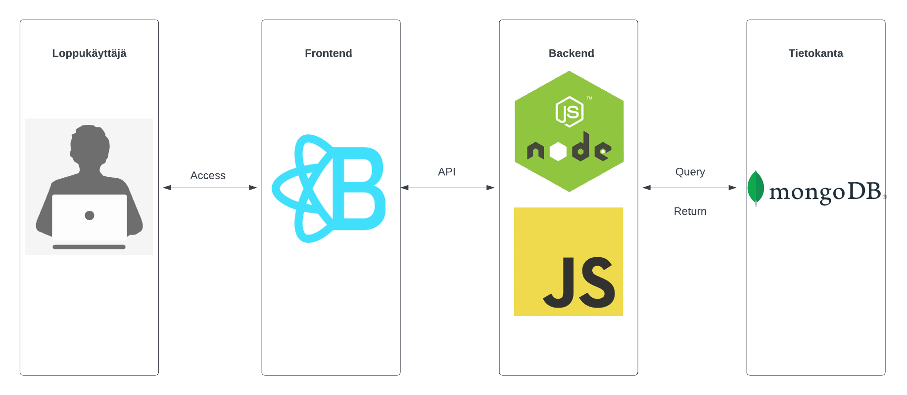
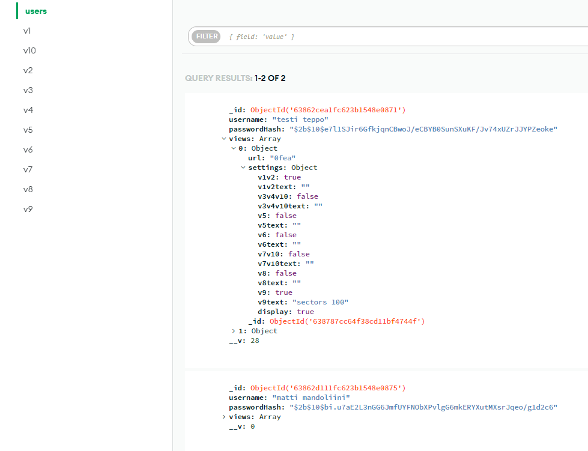

# Syksyn 2022 ryhmäprojekti

## Projektin nimi: Web-sovellusprojekti

## Linkki appiin: https://group5-visualizationtool-gbn4.onrender.com/ (kuvaajien datan lataus saattaa kestää hetken)

## Projektin aihe ja tarkoitus
Projektin aiheena oli tehdä visualisointityökalu, jossa voidaan tarkastella erilaisia ilmastonmuutokseen liittyviä kuvaajia. Sovelluksessa on myös mahdollista tehdä käyttäjä, jolla voidaan luoda omia visualisointinäkymiä yksilöllisillä url-tunnisteilla. Näkymiin käyttäjä voi valita haluamansa visualisoinnit ja asettelun, sekä kirjoittaa kuvaustekstin jokaiselle visualisoinnille. Käyttäjien luomat näkymät ovat löydettävissä julkisesti internetissä. 

Projektin tarkoituksena oli perehtyä full-stack ohjelmoinnin perusteisiin ja Kanban-kehitysmallin käyttämiseen.

## Mitä teknologioita projektissa on käytetty?

### Frontend

Sovelluksen frontend on toteutettu käyttäen ReactJS (JavaScript kirjasto), Bootstrap (CSS kehys) ja CSS:ää HTML:n tyylittämiseen. Erilaisten pakettien asentamiseen käytettiin npm:ää (node package manager). Mainisemisen arvoisia paketteja ovat: Chart.js, React-Chartjs-2, Axios, Bootstrap, React-Bootstrap

### Backend

Backend toteutettiin myös Javascriptillä käyttäen Node.js ajoympäristöä, käytössä on myös muunmuassa Express.js niminen kirjasto jota käytettiin sovelluksen API:n rakentamisessa, sekä Mongoose jonka avulla voitiin luoda yhteys tietokannan ja backendin välillä.

### Tietokanta

Tietokannaksi valittiin MongoDB, joka on avoimen lähteen dokumenttipohjainen NoSQL tietokanta. Suurin syy MongoDB:n valinnalle oli sen yksinkertainen rakenne.

## Arkkitehtuuri ja rakenne

### Sovelluksen rakenne

### Tietokanta rakenne

### Käyttöliittymäsuunnitelma
[Linkki figmaan](https://www.figma.com/file/tXrYVw573jIBt49oBs0tLg/Group5?node-id=0%3A1&t=NB8srzJ8xAbh7eVx-1)

## Käyttöönotto

### Lokaalisti

1. Kloonaa repositorio.
2. Siirry 'Client' kansioon ja asennna dependencyt komennolla 'npm install', tee sama 'Server' kansion sisällä.
3. Käynnistä sovelluksen frontend komennolla npm start 'Client' kansion sisällä.
4. Käynnistä sovelluksen backend komennolla npm run devStart 'Server' kansion sisällä.

### Ketkä tekivät ja mikä oli kenenkin rooli

## Junnu Kyrö 

Datan käsittely, 2 kuvaajaa, kuvaajien datan nouto Clienttiin, luo uusi näkymä -toiminto, käyttäjän näkymä -sivu, CSS, backend, frontend testit 

[Junnun GitHub](https://github.com/Jundeb)

## Antti-Jussi Niku 

Datan käsittely, 3 kuvaajaa, Poista käyttäjä -toiminto, responsiivisuutta, backend aloitus, visualisointi kuvauksia ja kuvaajien datan noutoa Mongosta. 

[Antti-Jussin GitHub](https://github.com/ArunJ0)

## Anssi Rauhala 

Datan käsittely, 2 kuvaajaa, kirjaudu sisään, rekisteröidy ja poista näkymä -toiminto, backend, backend testit ja CSS

[Anssin GitHub](https://github.com/luris123)

## Santtu Tiitinen 

Datan käsittely, UI alustus, responsiivisuus, Näkymät/Ulkoasu. 

[Santun GitHub](https://github.com/santtutiitinen)
